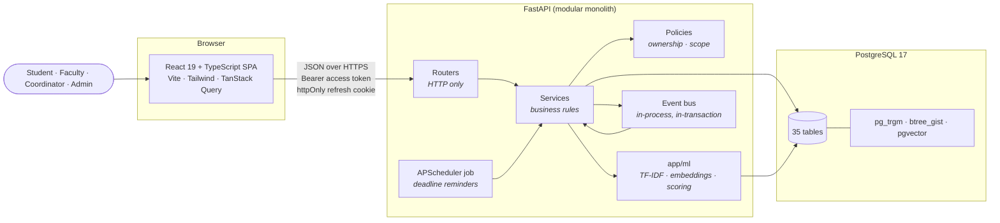
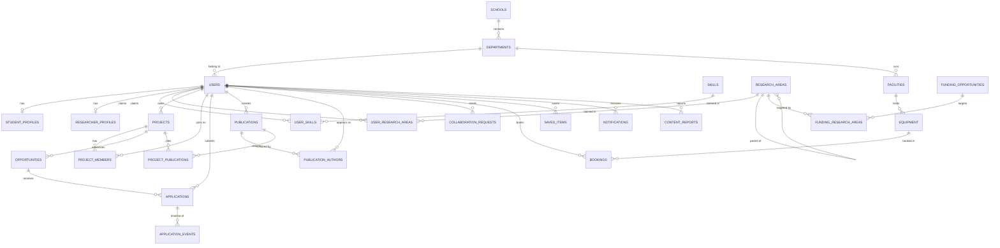

# Diagrams

Both diagrams are Mermaid, so they render on GitHub and stay diffable.

## System

Three things this picture is meant to make obvious: routers do no business
logic, every write goes through a policy before it touches a table, and the
event bus runs *inside* the caller's transaction (so a notification and the
thing it describes commit together).

## Entity relationships

Abbreviated: join tables and audit-style tables are described in the notes
rather than drawn, to keep the diagram readable.

Notes on the parts not drawn:

- **`audit_logs`** is append-only and references any entity by
  `(entity_type, entity_id)` — no foreign keys, by design.
- **`entity_embeddings`** stores one vector per `(entity_type, entity_id,
  model_name)`, likewise without foreign keys: it points at five different
  tables, and searches join back to the real table.
- **`saved_items`** points at exactly one of a project, opportunity,
  researcher or funding call (`CHECK num_nonnulls(...) = 1`).
- **`bookings.period`** is a `tstzrange` with an exclusion constraint, which
  is what makes double-booking impossible rather than merely unlikely.
- **`refresh_tokens`** are hashed, rotated, and grouped into families so a
  replayed token revokes the whole family.
- Join tables (`project_skills`, `project_research_areas`,
  `opportunity_skills`, `tag_aliases`, `tag_suggestions`) follow the obvious
  shape.
